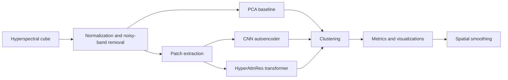

# Unsupervised Hyperspectral Land-Cover Mapping


This project studies unsupervised land-cover mapping from hyperspectral imagery using PCA baselines, CNN autoencoder embeddings, clustering, and spatial post-processing. Experiments cover Indian Pines, Pavia University, and EnMAP L2A scenes, with an additional HyperAttnRes transformer extension for learned spectral-spatial representations.

## Key Results

Representative clustering results from the generated CSV outputs:

| Dataset | Embedding | Method | Silhouette ↑ | DBI ↓ | ARI ↑ |
| --- | --- | --- | ---: | ---: | ---: |
| Indian Pines | PCA (30D) | DBSCAN | 0.3374 | 1.1671 | 0.4783 |
| Indian Pines | CNN AE (64D) | Hierarchical | 0.0842 | 2.3097 | 0.2800 |
| Pavia University | PCA (30D) | GMM | 0.0677 | 3.1322 | 0.3663 |
| Pavia University | CNN AE (64D) | KMeans | 0.0837 | 2.3284 | 0.3387 |
| Pavia University | CNN AE (64D) | HDBSCAN | 0.4077 | 1.4367 | 0.0057 |

## Pipeline



## Repository Structure

```text
.
├── 01_dataset_exploration.py
├── 02_preprocessing.py
├── 03_pca_baseline.py
├── 04_cnn_autoencoder.py
├── 05_cnn_clustering.py
├── 06_embedding_analysis.py
├── 07_spatial_smoothing.py
├── 08_final_report_assets.py
├── 10_analysis_plots.py
├── Advanced/                  # HyperAttnRes and transformer ablations
├── EnMap/                     # EnMAP-specific EDA, preprocessing, and clustering
├── datasets/mat_to_csv.py
├── docs/DATA.md
├── notebooks/                 # Exploratory notebooks
├── config.py                  # Shared labels, colors, plotting style
├── preprocessing.py           # Reusable preprocessing functions
├── run_pipeline.py
└── run_enmap_pipeline.py
```

Large raw imagery, processed arrays, trained weights, and generated outputs are intentionally excluded from Git. See [docs/DATA.md](docs/DATA.md) for the expected local data layout.

## Installation

```bash
python -m venv .venv
.venv\Scripts\activate
pip install -r requirements.txt
```

## Usage

Run the Indian Pines and Pavia University workflow:

```bash
python run_pipeline.py
```

Run the EnMAP workflow:

```bash
python run_enmap_pipeline.py
```

Outputs are written to `outputs/`, trained models to `models/`, and generated NumPy arrays to `processed_data/`.

## Methodology

The baseline pipeline normalizes hyperspectral bands, removes known noisy AVIRIS bands for Indian Pines, extracts spatial patches, and evaluates PCA embeddings with multiple clustering algorithms. The CNN autoencoder learns compact 64-dimensional embeddings from hyperspectral patches before clustering. The smoothing stage applies spatial majority filtering to reduce salt-and-pepper artifacts in raw cluster maps.

## Advanced: HyperAttnRes

The `Advanced/` module implements a transformer-style spectral-spatial autoencoder with block attention residuals. It compares HyperAttnRes against a standard transformer autoencoder and the CNN autoencoder using clustering metrics, embedding plots, and ablation visualizations.

## Results and Visualizations

Generated figures are not committed because they are reproducible artifacts. After running the pipeline, inspect:

```text
outputs/week1/   # dataset exploration
outputs/week3/   # PCA baseline metrics and plots
outputs/week5/   # CNN clustering metrics
outputs/week6/   # embedding visualizations
outputs/week7/   # spatial smoothing outputs
outputs/week8/   # summary tables and advanced analysis plots
```

## References

- Indian Pines dataset: Purdue MultiSpec hyperspectral data page.
- Pavia University dataset: Hyperspectral Remote Sensing Scenes, Computational Intelligence Group, University of the Basque Country.
- EnMAP mission and L2A products: German Aerospace Center (DLR) EnMAP documentation.
